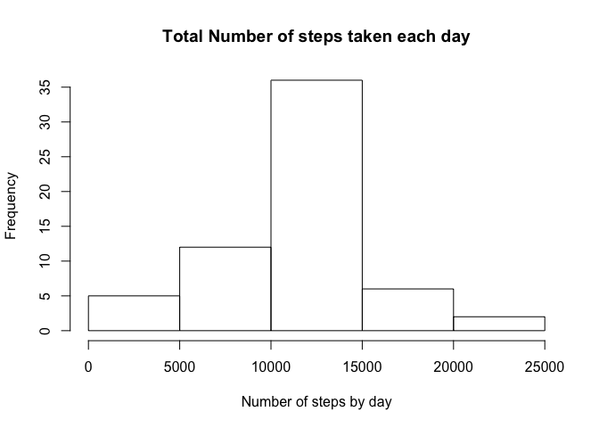

Loading and preprocessing the data
----------------------------------

First I will load the required packages

    paq<-c("dplyr","ggplot2","readr" )

    lapply(paq, function(paq) {if (!require(paq, character.only=T)) 
    {install.packages(paq);require(paq)}}) 

    ## Loading required package: dplyr

    ## 
    ## Attaching package: 'dplyr'

    ## The following objects are masked from 'package:stats':
    ## 
    ##     filter, lag

    ## The following objects are masked from 'package:base':
    ## 
    ##     intersect, setdiff, setequal, union

    ## Loading required package: ggplot2

    ## Loading required package: readr

We unzip the data and read it.

    zipF<- "activity.zip"
            unzip(zipF,overwrite = TRUE)

    dataF<-"activity.csv"
            activity<-read_csv(dataF)

    ## Parsed with column specification:
    ## cols(
    ##   steps = col_integer(),
    ##   date = col_date(format = ""),
    ##   interval = col_integer()
    ## )

    str(activity)                

    ## Classes 'tbl_df', 'tbl' and 'data.frame':    17568 obs. of  3 variables:
    ##  $ steps   : int  NA NA NA NA NA NA NA NA NA NA ...
    ##  $ date    : Date, format: "2012-10-01" "2012-10-01" ...
    ##  $ interval: int  0 5 10 15 20 25 30 35 40 45 ...
    ##  - attr(*, "spec")=List of 2
    ##   ..$ cols   :List of 3
    ##   .. ..$ steps   : list()
    ##   .. .. ..- attr(*, "class")= chr  "collector_integer" "collector"
    ##   .. ..$ date    :List of 1
    ##   .. .. ..$ format: chr ""
    ##   .. .. ..- attr(*, "class")= chr  "collector_date" "collector"
    ##   .. ..$ interval: list()
    ##   .. .. ..- attr(*, "class")= chr  "collector_integer" "collector"
    ##   ..$ default: list()
    ##   .. ..- attr(*, "class")= chr  "collector_guess" "collector"
    ##   ..- attr(*, "class")= chr "col_spec"

What is mean total number of steps taken per day?
-------------------------------------------------

In this part we will ignore the missing values in the dataset.

1.  Make a histogram of the total number of steps taken each day

<!-- -->

    hist1<-activity %>% group_by(date) %>% summarise(s_steps=sum(steps,na.rm=T))
    with(hist1, hist(s_steps, main = "Total Number of steps taken each day",
         xlab = "Number of steps by day"))

1.  Calculate and report the **mean** and **median** total number of
    steps taken per day

<!-- -->

    with_na <- c(mean=round(mean(hist1$s_steps),2), median = round(median(hist1$s_steps),2))
    with_na

    ##     mean   median 
    ##  9354.23 10395.00

What is the average daily activity pattern?
-------------------------------------------

1.  Make a time series plot (i.e. `type = "l"`) of the 5-minute interval
    (x-axis) and the average number of steps taken, averaged across all
    days (y-axis)

<!-- -->

    plot1<-activity %>% group_by(interval) %>% summarise(a_steps=mean(steps,na.rm=T))
    ggplot(plot1,aes(x=interval,y=a_steps) )+
            geom_line()+
            labs(title = "Average Number of steps by interval",
                 y = "Average Number of steps")

1.  Which 5-minute interval, on average across all the days in the
    dataset, contains the maximum number of steps?

<!-- -->

    maxint <- plot1[plot1$a_steps == max(plot1$a_steps),1]

The interval is 835

Imputing missing values
-----------------------

1.  Calculate and report the total number of missing values in the
    dataset (i.e. the total number of rows with `NA`s)

Ther are only missing values in the variable steps.

    activity$na <- is.na(activity$steps)
    na <- sum(activity$na)
    pct <- round(mean(activity$na)*100,2)

The total number of missing values in the dataset is 2304 which
represents a 13.11 % of total observations.

1.  Devise a strategy for filling in all of the missing values in the
    dataset. The strategy does not need to be sophisticated. For
    example, you could use the mean/median for that day, or the mean for
    that 5-minute interval, etc.

For filling the missing values I will use the mean for that 5-minute
interval in all days

1.  Create a new dataset that is equal to the original dataset but with
    the missing data filled in.

<!-- -->

    plot1<-as.data.frame(plot1)
    activity2<-as.data.frame(activity)
    for (i in seq(1:nrow(activity2))){
            if (activity2[i,4]==TRUE){
                    activity2[i,1]=plot1[plot1$interval==activity2[i,3],2]
            }
    }

    newna <- sum(is.na(activity2$steps))
    newna

    ## [1] 0

In the new dataset **activity2** total na are 0.

1.  Make a histogram of the total number of steps taken each day and
    Calculate and report the **mean** and **median** total number of
    steps taken per day.

<!-- -->

    hist2<-activity2 %>% group_by(date) %>% summarise(s_steps=sum(steps,na.rm=T))
    with(hist2, hist(s_steps, main = "Total Number of steps taken each day",
                     xlab = "Number of steps by day"))

    without_na <- c(mean=round(mean(hist2$s_steps),2), median = round(median(hist2$s_steps),2))
    without_na

    ##     mean   median 
    ## 10766.19 10766.19

*Do these values differ from the estimates from the first part of the
assignment? *

    table<-cbind(with_na,without_na)
    table

    ##         with_na without_na
    ## mean    9354.23   10766.19
    ## median 10395.00   10766.19

Both, mean and median have increase to the same value

*What is the impact of imputing missing data on the estimates of the
total daily number of steps?*

The distribution of steps by day is now more simetric and the mean and
median are equal

Are there differences in activity patterns between weekdays and weekends?
-------------------------------------------------------------------------

1.  Create a new factor variable in the dataset with two levels –
    “weekday” and “weekend” indicating whether a given date is a weekday
    or weekend day.

<!-- -->

    activity2$wd<-weekdays(activity2$date)
    wend <- unique(weekdays(activity2$date))[6:7]

    for (i in seq(1:nrow(activity2))){
            if (activity2[i,5] %in% wend){
                    activity2[i,5]="weekend"
            }
            else {
                    activity2[i,5]="weekday"    
            }
    }

    activity2$wd <- as.factor(activity2$wd)

    str(activity2$wd)

    ##  Factor w/ 2 levels "weekday","weekend": 1 1 1 1 1 1 1 1 1 1 ...

1.  Make a panel plot containing a time series plot (i.e. `type = "l"`)
    of the 5-minute interval (x-axis) and the average number of steps
    taken, averaged across all weekday days or weekend days (y-axis).

<!-- -->

    plot3 <- activity2 %>% group_by(wd,interval) %>%                         summarise(a_steps=mean(steps,na.rm=T))

    ggplot(plot3, aes(x=interval, y=a_steps))+
            geom_line()+
            facet_grid(wd~.)+
            labs(y="Number of steps")

It looks as if there would be a different pattern in average steps by
interval depending on weekdays or weekend.
